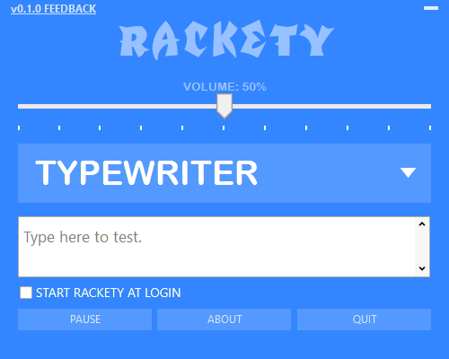

<h1 align="center">
  
    
  Rackety
   
   
</h1>

<h4 align="center">Sound FX for typists!</h4>
<h5 align="center"><i>Inspired by <a href="https://andyman404.itch.io/soundtypist">Sound Typist</a></i></h5>

<h1 align="center">
  </a>  
</h1>

<h1 align="center">
  <a href="https://girkovarpa.itch.io/rackety">
  👉 Download for Windows 👈</a>
</h1>
